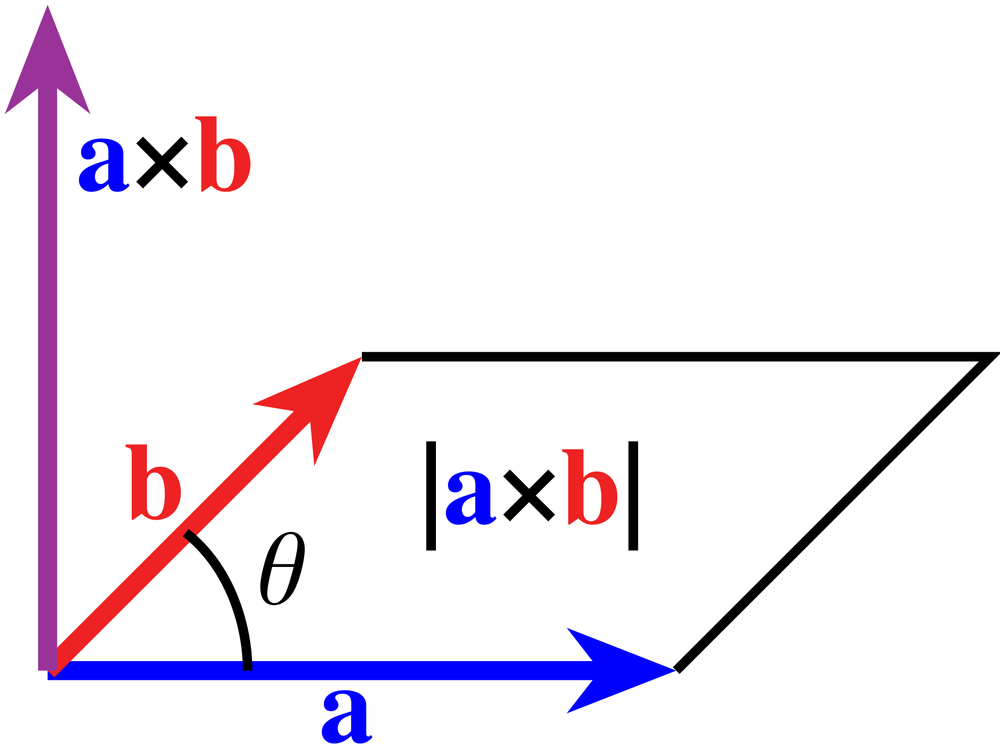

Vectors
#######

:date: 2024-10-06 12:00
:modified: 2024-10-06 12:00
:tags: math, vectors
:category: math
:slug: vectors-intro
:authors: Michael Bocek
:summary: Introduction to vectors

Distance and displacement 
=========================

If you walk five miles east, and then two miles west, how much have you moved? There's two sensible answers to this question

.. raw:: html

    <canvas id="fig-2a-distance-vs-displacement" width="300" height="100">Visualization of vector drawing</canvas>
    

- Seven miles, because that's the total distance that you've walked (incuding doubling back)
- Three miles, because someone starting where you started would have to walk three miles to get to you 

Neither of these is wrong or right - physicists would call the first number (seven miles) the *distance* traveled, and the second number (three miles) the *displacement*. We can get the distance by adding all of the individual distances together - obviously, five plus two is seven. For displacement, we do something similar with a small twist - we count travel to the east as "positive", and travel to the west as "negative". So our displacement is :math:`7 + -2 = 5` [#]_.

In general, there's more situations in physics that are like displacement, where we want things in opposite directions to cancel. This is straightforward enough in 1 dimension - we can just keep track of displacement (or whatever other quantity) using positive and negative numbers. Of course, the world we live in is 3-dimensional (4 if you count time) - so we'll need some sort of new approach that can take into account multiple dimensions, while cancelling in the same way. One way to do it would be to "bundle" the numbers together. We'd agree that the first number represents our East-West position, the second number represents our North-South position, and (if necessary) the third number represents our up-down position.   This strategy of "bundling" the numbers together is exactly what we call a *vector*. 

To add vectors, we just add their individual numbers. Try playing around with the demo below to get the idea - you can add a vector to the previous chain by clicking on the display, or clear the display with the escape or Q keys. We'll write the individual components (east-west and north-south) in square brackets, so [-5, 4] corresponds to 5 units west, and 4 units north. The sum of all of these vectors together is represented by the vector in red:  

.. raw:: html

    <canvas id="vector-addition" width="300" height="200">Visualization of vector drawing</canvas>
    

This example is two dimensional, but for 3 dimensions the idea is the same. We just need three numbers: east-west, north-south, and up-down. In theory there's not a limit to the number of dimensions a vector could have (except for our own imaginations) - often in abstract math its very useful to work with vectors in 4 or more dimensions, as we'll see later [#]_. 

For the purposes of this article a lot of the vectors we'll work with will be 2-dimensional. Part of this is that it's easier to visualize these vectors on a page than 3D vectors - still, I'll try to use a mix of 2D and 3D vectors in the math examples, just to get us used to seeing both.

A word on notation
------------------

When we know what numbers make up a vector, we'll write them in square brackets like we in the demo above. It's a little unnatural to write numbers in a column at first, but the notation is important as we'll see later. 

There's another way that people sometimes write vectors. Instead of grouping the numbers in a column, they'll write each component separately, using :math:`\widehat{i}` as the X-axis,  :math:`\widehat{j}` as the X-axis, and  :math:`\widehat{k}` as the Z-axis,. So the vector :math:`\begin{bmatrix}1\\-2\\5\end{bmatrix}` would get re-written as :math:`\widehat{i} - 2\widehat{j} + 5\widehat{k}`. This notation is interchangeable with the more standard brackets. 

More often though, we'll write equations with vectors using variables, rather than explicitly writing out the components of the vector. This raises a problem - probably every object you've used in the past has been a sort of number (an integer, fraction, real number, etc), so we haven't had to be very careful with notation. Vectors are the first things that most of us work with in math that are not just numbers, and so there's a few ways that mathematicians and physicists use to distinguish them. 

Probably the most common way to distinguish vectors from numbers are to bold them, like :math:`\mathbf{v}` - that's what we'll use here for most cases. Alternatively, you will sometimes see people draw a little arrow above the variable, like :math:`\vec{v}`.  Finally, in quantum mechanics there's a special sort of notation that gets used for vectors to illustrate that they are being used in a more "abstract" sense - we would write the vector v as :math:`|v\rangle`.

Adding vectors 
==============

Like we saw in the demo above, we can add vectors by adding their components. Mathematically that's about as easy as it can get. 

Vector addition is commutative (doesn't depend on order.) This is straightforward enough to see from the math - after all, we know that order doesn't matter for addition, and all that we're doing here is adding numbers together. So if we add :math:`\begin{bmatrix}a\\b\end{bmatrix} + \begin{bmatrix}c\\d\end{bmatrix}`, that's the same as :math:`\begin{bmatrix}a+c\\b+d\end{bmatrix}` which we could then choose to re-write as  :math:`\begin{bmatrix}c\\d\end{bmatrix} + \begin{bmatrix}a\\b\end{bmatrix}`. 

Visually this ends up being pretty striking though - in the demo below, we'll automatically shuffle the addition order of the vectors that you drew above. Notice that no matter how we shuffle things, they still add up to the same result! 

.. raw:: html

    <canvas id="figure-2c-commuitivity" width="300" height="200">Visualization showing that vector addition is commutitive</canvas>
    

Can we multiply vectors?
========================

We've seen already that you can add vectors by adding their components. It would be a reasonable guess then to think that we can multiply vectors by multiplying their components to get a new vector. In math this is called the `Hardamard product <https://en.wikipedia.org/wiki/Hadamard_product_(matrices)>`_ (usually abbreviated :math:`\odot`) - so we would do something like 

:math:`\begin{bmatrix}5\\2\end{bmatrix} \odot \begin{bmatrix}3\\7\end{bmatrix} =  \begin{bmatrix}15\\14\end{bmatrix}`

Unfortunately, it turns out that this definition doesn't end up being very useful in physics. To see why - let's compare two different pairs of vectors. In the first situation, our vectors are perfectly aligned with the axes

.. raw:: html

    

    <canvas id="figure-2d-product-1" width="200" height="200">Vectors drawn along the axes</canvas>
    
    

So the result of the Hadamard product is 

:math:`\begin{bmatrix}4\\0\end{bmatrix} \odot \begin{bmatrix}0\\4\end{bmatrix} =  \begin{bmatrix}0\\0\end{bmatrix}`

Now, let's rotate our two vectors by 45 degrees - but we'll keep the relationship between them exactly the same otherwise. If you're not totally comfortable with the math here, don't worry too much about the details for the moment.

.. raw:: html

    

    <canvas id="figure-2d-product-2" width="200" height="200">Vectors drawn along the axes</canvas>
    

Now the result of the Hardamard product is:

:math:`\begin{bmatrix}2\sqrt{2} \\ 2\sqrt{2}\end{bmatrix} \odot \begin{bmatrix}2\sqrt{2} \\ -2\sqrt{2}\end{bmatrix} =  \begin{bmatrix}8\\-8\end{bmatrix}`

Now if you think about it for a second, this doesn't make a lot of sense. The relationship between the vectors is exactly the same in these two examples - all we've done is rotate them relative to the axes of our coordinate system. But the coordinate system isn't "real" in any sense - we should be able to choose whichever set of coordinates is most convenient for our purposes. But here we get a dramatically different answer depending on what direction the our axes are facing. In the first case, we get a zero vector, while in the second case we get a decidedly non-zero vector. 

For this reason, we don't really find a lot of use for the Hardamard product in physics (although there are other uses for it in pure mathematics.) There are other ways that we can "multiply" vectors though that are incredibly useful. Let's start with one obvious one:

Multiplication as repeated addition (scaling)
=============================================

One way to think about multiplication is that it's a way to simplify repeated additions - when we evaluate 3 * 5, what we're really doing is adding 5 to itself 3 times (5 + 5 + 5). We certainly know how to add vectors - so could we just define "vector multiplication" as repeated addition? Of course we can - as an example, we could do something like 

:math:`3 \cdot \begin{bmatrix}5\\2\end{bmatrix} = \begin{bmatrix}5\\2\end{bmatrix} +\begin{bmatrix}5\\2\end{bmatrix} +\begin{bmatrix}5\\2\end{bmatrix}  = \begin{bmatrix}3 \cdot 5\\3 \cdot 2\end{bmatrix} = \begin{bmatrix}15\\6\end{bmatrix}`

Extending it a little further, we can see more generally that this definition of multiplication basically just involves multiplying every element of the vector by the same number - in mathematical language 

:math:`a \cdot \mathbf{v} = a \cdot \begin{bmatrix}x\\y\end{bmatrix} = \begin{bmatrix}a \cdot x\\ a \cdot y\end{bmatrix}`

There's not really any need for :math:`a` to be an integer here then - we can happily multiply every element of a vector by :math:`-2`, or :math:`\frac{1}{2}`, or :math:`\pi`, or really whatever number we want. 

What does this "mean" more generally? In the demo below, you can draw a vector and then see what the effect of multiplying differnet numbers on it would be. 

.. raw:: html

    
 
    <input type="range" id="scale-slider" name="scale-slider" min="-2" max="2" step="0.05" list="markers" style="width: 300px"/>
    

    <datalist id="markers">
    <option value="-1" ></option>
    <option value="-1"></option>
    <option value="0" ></option>
    <option value="1" ></option>
    <option value="2" ></option>
    </datalist>
    <canvas id="figure-2e-scaling" width="300" height="200">Visualization of scaling a vector</canvas>
    

One common way to think about this is that the number you use to multiply the vector re-sizes (or "scales") the whole vector, while keeping it pointing in the same direction. Because of this, these numbers are then often called scalars - and in fact, in the context of vector algebra we often will call standalone numbers "scalars" as a matter of terminlology.

The length of a vector
======================

There's one detail that we've glossed over so far, but that's worth calling out explicitly. In the earlier demo where we added vectors together, we kept track of both the total distance, and the overall displacement that the path took. But we didn't actually describe how to calculate these lengths. Obviously for a vector like :math:`\begin{bmatrix}0\\20\\0\end{bmatrix}` it's pretty obvious how to do this - we only move in one direction, so the total length is just 20. 

What about for a vector that has non-zero components in multiple directions? There's a nice geometric way to get this - we can just measure the distance along each of the axes, and then make a right triangle. The hypotenuse (diagonal) is the length of the vectors, while the sides are just the distances along each axis. But these are just the components of the vectors. The diagram below is probably helpful: 

.. raw:: html

    <canvas id="figure-2ea-distance" width="300" height="200">Visualization showing that vector addition is commutitive</canvas>
    

We can then just use the pythagorean theorem to get the length! So for a vector :math:`\mathbf{v} = \begin{bmatrix}x\\y\end{bmatrix}`, the length is :math:`\sqrt{x^2 + y^2}`. The logic works for 3D (or even higher-dimensional) vectors as well - for a 3d vector, the length is :math:`\sqrt{x^2 + y^2 + z^2}`. In general the shorthand for the length of a vector (of any dimensionality) is :math:`\left\lVert\mathbf{v}\right\rVert`. 

It's also sometimes useful to be able to go backwards - if we have the length and we want to get the sides, we can use the cosine and sine functions to get them. Using the angle that we've shown on the plot, the coordinates of the vector will generally be :math:`\begin{bmatrix}\left\lVert\mathbf{v}\right\rVert cos(\theta) \\ \left\lVert\mathbf{v}\right\rVert sin(\theta)\end{bmatrix}`. If you ever get confused though, draw a diagram, and rely on Soh-Cah-Toh (sine is the opposite side to the angle, cosine is the adjacent side).

We've taken a view of vectors so far that focuses pretty strongly on them as being built out of individual numbers representing their individual coordinates. But it's not at all uncommon to think first of the total length of a vector as its main property, and then to think of that length as being oriented in a particular direction. This is a perspective that will definitely become more clear the longer we work with vectors.

Multiplication as an "Area"
===========================

When we tackled units before, one of our key rules was that if you multiply two quantities, their units must multiply as well. We've been treating vectors as a way to model displacement, which is essentially length. Of course, if we had two numbers that were measured in terms of meters and we multipled them together, the result would be square meters (i.e. :math:`m \cdot m = m^2`), which is a type of area.

It would make a lot of sense then if we could multiply two vectors together to get a sort of "area." Let's think about how this would ideally work - 

#. First off, we'd want the "area" to grow and shrink with the sizes of the vectors. If the first vector was scaled to be twice as large, we'd want the area also to be twice as large 
#. If two vectors were exactly parallel with each other, we'd probably want the area to be zero. Correspondingly if two vectors were exactly perpendicular to each other, we'd probably want the area to match with the area of the square/rectangle formed by them together 
#. If we made one of the vectors negative, it would proabably make sense for the area to be negative as well. 

The third idea might seem a little weird at first. In the real world it's not too hard to understand what we mean by "negative displacement" - if positive is East, then negative is West. But what's a negative area? There's not really examples of a shape that "subtracts" area away from other shapes. Even if it seems a little unnatrual at first, there are quite a few physical situations where it makes sense to be able to cancel out areas the same way we cancel out vectors.

It turns out that there's a mathematical construct that exactly represents this idea - the *wedge product*. For two vectors :math:`\mathbf{u}` and :math:`\mathbf{v}`, we write the wedge product like :math:`\mathbf{u} \wedge \mathbf{v}`. Below, you can try placing some vectors and see the result of the wedge product in 2D for them:

.. raw:: html

    <canvas id="figure-2f-wedge-product" width="300" height="200">Visualization showing that vector addition is commutitive</canvas>
    

The product is distributive, so 

.. math::
   
    (\mathbf{u} + \mathbf{v}) \wedge \mathbf{w} = \mathbf{u} \wedge \mathbf{w} + \mathbf{v} \wedge \mathbf{w}

Although we can't wedge together more than 2 vectors in 2D, the wedge product is also associative. If we have 3 3D vectors :math:`\mathbf{u}, \mathbf{v}, \mathbf{w}`, then it doesn't matter how we choose to break the calcualtion down: 

.. math ::
     (\mathbf{u} \wedge \mathbf{v}) \wedge \mathbf{w} = \mathbf{u} \wedge (\mathbf{v} \wedge \mathbf{w})

Maybe surprisingly though - the wedge product is *not* commutative. In fact, we can be even more specific - if we reverse the order of the two vectors, we get the negative version of the area. In mathematical language we say that the wedge product is *anticommutitive*.

.. math::
    
    \mathbf{u} \wedge \mathbf{v} = -\mathbf{v} \wedge \mathbf{u} 

Another interesting thing about this equation is that it immediately implies that :math:`\mathbf{v} \wedge \mathbf{v} = 0`, and :math:`\mathbf{v} \wedge -\mathbf{v} = 0` for any vector

.. admonition:: Excercise
    
     Use the fact that :math:`\mathbf{u} \wedge \mathbf{v} = -\mathbf{v} \wedge \mathbf{u}` to show that  :math:`\mathbf{v} \wedge \mathbf{v} = 0` for any vector :math:`\mathbf{v}`

One more thing - how do we decide what is "negative" area and what is "positive?" The rule that we follow is called the "right-hand" rule. What you can do is the fingers on your right hand in the direction of the first vector (:math:`\mathbf{u}`), and then curl them in the direction of the second vector (:math:`\mathbf{v}`). If your thumb points up, then the area is positive. If it points down, the area is negative.

   A right hand illustrating the direcitonality of "positive" area for the wedge product (`from the wikipedia article <https://en.wikipedia.org/wiki/Right-hand_rule#/media/File:Right-hand_grip_rule.svg>`_)

So what sort of object is :math:`\mathbf{u} \wedge \mathbf{v}`? Because it represents a sort of "oriented area" created out of two vectors, it's typically called a *bivector*. Similarly, the result of :math:`\mathbf{u} \wedge \mathbf{v} \wedge \mathbf{w}` is a 3D volume, which we call a *trivector*. Don't worry too much if the flood of definitions is a little bit too much - the most important idea here is to understand that the wedge product allows us to multiply vectors in the same way that we'd multiply lengths in terms of units.

We've given some formal definitions of the wedge product so far, but I think it's not really clear at all how we'd actually calculate one given two vectors. Let's try wedging together two example vectors just to get a sense of how the product behaves in a real calculation

A quick example calculation
---------------------------

Let's take it a step further and take two 2D vectors - say :math:`\mathbf{u} = \begin{bmatrix}1\\2\end{bmatrix}` and :math:`\mathbf{v} = \begin{bmatrix}3\\5\end{bmatrix}`, and see if we can use this equation to get the wedge product between them. We'll re-write these vectors in a more suggestive way using the "unit-vector" notation above - so :math:`\mathbf{u} = \widehat{i} + 2\widehat{j}` and :math:`\mathbf{v} = 3\widehat{i} + 5\widehat{j}`. Now let's multiply them out - we'll treat the "wedge" just like a normal multiplication sign, which gets us 

.. math::
    
    (\widehat{i} \wedge 3\widehat{i}) + (\widehat{i} \wedge 5\widehat{j})  + (3\widehat{i} \wedge 2\widehat{j})  +  (2\widehat{j} \wedge 5\widehat{j})

We can simplify this some - the first and last terms are zero, since we're wedging a vector with itself. In theory we could condense terms, but for the moment we'll leave them separate for convenience.

.. math::
    
    (\widehat{i} \wedge 5\widehat{j})  + (2\widehat{j} \wedge 3\widehat{i})

Now we'll use our rule above to flip the "sign" for the second wedge. We'll also (partially) condense the terms

.. math::
    
    (\widehat{i} \wedge 5\widehat{j})  - (3\widehat{i} \wedge 2\widehat{j}) = ((1 \cdot 5) - (3 \cdot 2))\widehat{i} \wedge \widehat{j}

.. admonition:: Excercise
     
    We can generalize this some (and you should try!) For two vectors :math:`\mathbf{u} = \begin{bmatrix}a\\b\end{bmatrix}` and :math:`\mathbf{v} = \begin{bmatrix}c\\d\end{bmatrix}`, can you work out what :math:`\mathbf{u} \wedge \mathbf{v}` is?

The cross product
-----------------

This is (I think at least) a pretty beautiful way to think about multiplying vectors - it preserves a lot of our intuition about how lengths "should" combine to create areas and volumes, and seems to hint at a larger structure that might be interesting to explore. That structure is definitely interesting - mathemaiticans call it an *exterior algebra* on vectors. 

For better or for worse though, this is not how physicists like to think. Phyisicists aren't really interested in mathematical structures for the love of math - they want to use them to model real like situations, and are only too happy to take (reasonable) shortcuts if the more formal math is too irritating to deal with. As you might imagine, the idea of also now having to handle bivectors in calculations is enough to give a lot of phyicists nightmares.

There's a lot of physical situations though that are well modeled by the wedge product. So what to do? Well, it turns out that there's a way that we can treat a bivector in 3 dimensions as though it were a vector after all. We can even go ahead and add/cancel negative and positive "areas" together just by adding these vectors. How does this work?

Basically phyicists like to pretend like the "area" of the bivector is actually its own vector that points directly out from the surface. Here's a diagram that does a pretty good job visualizing what I mean: 

   The cross product in 3D - the length of the vector is the same as the area of the wedge product between :math:`\mathbf{a} \wedge \mathbf{b}`, while the vector points perepndicular to the plane of the wedged area (`from the Wikipeida cross-product article <https://en.wikipedia.org/wiki/Cross_product#/media/File:Cross_product_parallelogram.svg>`_)

Since we're putting two vectors into the product, and getting a vector back out, this looks an awful lot like a way to multiply vectors. Physicists call this process the "cross product", and typically write it like :math:`\mathbf{u} \times \mathbf{v}`.

The vector that we get has a length that is the same as the *area* spanned by the wedge product :math:`\mathbf{u} \wedge \mathbf{v}`. This means that many of the same formulas and results that we saw before still apply to the cross product - for example 

.. math::

    \mathbf{u} \times \mathbf{v} = -\mathbf{v} \times {u}

and 

.. math::
    \mathbf{v} \times \mathbf{v} = 0

Here's one other useful result - if we have :math:`\mathbf{u} \times \mathbf{v} = \mathbf{w}` then 

.. math::
    \lvert \mathbf{w} \rvert =  \lvert \mathbf{u} \rvert \lvert \mathbf{v} \rvert sin(\theta)

Where :math:`\theta` is the angle between the two vectors. You can sanity check this with what we alrady know - for example, :math:`sin(0) = 0` and :math:`sin(90^{\circ}) = 1`, which squares with our understanding that two parallel vectors have a wedge product of 0, and two perpendicular vectors have a wedge product of their lengths (since they form a rectangle.)

One thing that you might have noticed - technically we have two choices of vectors that are perpendicular to a plane - one "above" and one "below". The rule is the same as for the wedge product, where we use a "right hand" convention. One common trick is to point the fingers on your right hand in the direction of the first vector, and then curl them towards the second. The direction that your thumb points is the direction of the cross product.

Here's one other sort of weird thing about the cross product - it only really works in 3 dimensions! We're relying on the coincidence that the wedge product of two vectors is an area - which leaves one more dimension that we can use for the cross-product vector. 

There's one more way to multiply vectors that we should cover, and then we can call it a day. This is frankly probably the most interesting of the three products that we'll talk about, but in many ways it's probably the hardest to get your head around.

The dot product
===============

In a lot of situations in physics, we'd like to be able to multiply vectors in a way that prioritizes *parallel* vectors. As a rough example, let's think about pushing a heavy object on wheels 1m across a floor, 1m up a :math:`45^{\circ}` ramp, and lifting it 1m straight up. Although we haven't really talked about it, we can think of gravity as a vector that points straight down for this example. In the first situation, we're perpendicular to the force of gravity, in the second we're halfway angled against it, and in the third we're exactly parallel (but opposite). Correspondingly the situations are the same order of "difficulty." Similarly, if we were to double the distance to 2m (or double the strength of gravity), it would become twice as difficult. It would be nice to have a product that we could use to model these situations.

The Hardamard product doesn't seem totally wrong here, but we already know that it has some weird problems with rotations. Is there a way to modify the Hardamard product so that it no longer is so dependent on the specific orientation of the input vectors? Let's go back to the two examples that we had above 

.. math::
    
    `\begin{bmatrix}4\\0\end{bmatrix} \odot \begin{bmatrix}0\\4\end{bmatrix} =  \begin{bmatrix}0\\0\end{bmatrix}`

.. math:: 
    `\begin{bmatrix}2\sqrt{2} \\ 2\sqrt{2}\end{bmatrix} \odot \begin{bmatrix}2\sqrt{2} \\ -2\sqrt{2}\end{bmatrix} =  \begin{bmatrix}8\\-8\end{bmatrix}`

Here's someting not obvious at all about the results - even though the vectors are different, if we *add up* the individual elements of these vectors, we find that they're both exactly zero (8 -8, and 0 + 0). Of course, that's not much of a matheaticial proof, but it's a hint that we might be on to something here.

In fact, we've described probably the most important way that we have to multiply vectors - the *dot product*. Although we don't quite have the machinery to prove it yet, the dot product of two vectors is *rotationally invariant*, which is a fancy way of saying that it doesn't change if we rotate all of the vectors together by the same angle.

.. math::
    \mathbf{u} \cdot \mathbf{v} = \begin{bmatrix}x_1\\y_1\end{bmatrix} \cdot \begin{bmatrix}x_2\\y_2\end{bmatrix} = x_1y_1 + x_2y_2

Similarly for 3D vectors, we'd have 

.. math::
    \mathbf{u} \cdot \mathbf{v} = \begin{bmatrix}x_1\\y_1\\z_1\end{bmatrix} \cdot \begin{bmatrix}x_2\\y_2\\z_2\end{bmatrix} = x_1x_2 + y_1y_2 + z_1z_2

Unlike the cross product, the dot product works for vectors in any dimension. What's a little weird though is that we don't get a vector out - instead we get a number (i.e. a *scalar*). There's a remarkable formula for interpreting this number that seems almost too good to be true [#]_ -

.. math::
    \mathbf{u} \cdot \mathbf{v} = \left\lVert\mathbf{u}\right\rVert \left\lVert\mathbf{v}\right\rVert cos(\theta)

Where (as we defined earlier) :math:`\left\lVert\mathbf{v}\right\rVert` is the length of v, and :math:`\theta` is the angle between the two vectors. This is sort of crazy! Imagine trying to calculate this alone - we'd have to somehow measure the angle between the vectors, calcualte the cosine of the angle, calculate the length of each vector, and then multiply them all together. But just by multiplying the components and adding them together we get this result basically for free, just from the components! 

Let's talk through some consequences of this 

#. Since :math:`cos(0^{\circ}) = 1`, if two vectors :math:`\mathbf{u}` and :math:`\mathbf{v}` are paralell with each other, then :math:`\mathbf{u} \cdot \mathbf{v} = \left\lVert\mathbf{u}\right\rVert \left\lVert\mathbf{v}\right\rVert`, meaning we just take the product of their lengths. In particular, if we take the dot product of any vector :math:`\mathbf{v}` with itself, we will get :math:`\mathbf{v} \cdot \mathbf{v} = \left\lVert\mathbf{v}\right\rVert^2`. So another way of writing the length of a vector is :math:`\sqrt{\mathbf{v} \cdot \mathbf{v}}`
#. Since  :math:`cos(90^{\circ}) = 0`, the dot product of any two perpendicular vectors is always zero
#. Since  :math:`cos(180^{\circ}) = -1`, the dot product of antiparallel vectors is the negative of the dot product of parallel vectors
#. More generally, we can think of the dot product as multiplying the parts of two vectors that are "in common" along the same axis. 

To extrapolate on this last point a little more - in the diagram below we'll expicitly show the *projection* of a vector we can move (:math:`\mathbf{u}`), onto a vector that's fixed on the positive x-axis (:math:`\mathbf{v}`). Since :math:`\mathbf{v}` has no vertical component, the part of :math:`\mathbf{u}` that's parallel to :math:`\mathbf{v}` is just its X-coordinate, which is (as we said above) the same thing as :math:`\left\lVert\mathbf{u}\right\rVert cos(\theta)` We'll also show the value of the dot product so that you can get a little more used to how it behaves with these two vectors. Namely, we can get the dot product of these two vectors by multiplying the length of :math:`\mathbf{v}` along the x-axis along with the length that we're showing as :math:`\left\lVert\mathbf{u}\right\rVert cos(\theta)`.

.. raw:: html

    <canvas id="figure-2g-dot-product" width="300" height="200">Visualization showing that vector addition is commutitive</canvas>
    

As an aside - This sort of diagram is actually a helpful way to show that the dot product of any two vectors :math:`\mathbf{u}` and :math:`\mathbf{v}` is :math:`\left\lVert\mathbf{u}\right\rVert \left\lVert\mathbf{v}\right\rVert cos(\theta)`. We have to rely on our (so far unproven) result that the dot product is rotationally invariant, but if we have this, we can take the following steps:

#. Take the plane spanned by the two vectors
#. Rotate :math:`\mathbf{v}` so that it lies along the x-axis

Say that our vectors are 3-dimensional, although we can show pretty easily that this works for any dimension of vector. :math:`\mathbf{v}` will now have the form :math:`\begin{bmatrix}\left\lVert\mathbf{v}\right\rVert \\ 0 \\ 0\end{bmatrix}`, since we've rotated it so that its full length lies along the x-axis. Now the angle between :math:`\mathbf{u}` and :math:`\mathbf{v}` will still be :math:`\theta`, so in this plane, it's not too tough to show that :math:`\mathbf{u}` will have the form :math:`\begin{bmatrix}\left\lVert\mathbf{u}\right\rVert cos(\theta) \\ \left\lVert\mathbf{u}\right\rVert sin(\theta) \\ 0 \end{bmatrix}`. With these vectors in this nice form, we can take the dot product of the two of them as 

.. math::

    \mathbf{u} \cdot \mathbf{v} = \begin{bmatrix}\left\lVert\mathbf{u}\right\rVert cos(\theta) \\ \left\lVert\mathbf{u}\right\rVert sin(\theta) \\0\end{bmatrix} \cdot \begin{bmatrix}\left\lVert\mathbf{v}\right\rVert \\ 0 \\ 0 \end{bmatrix} 

And of course, we can write the dot product as

.. math ::

    (\left\lVert\mathbf{u}\right\rVert cos(\theta))(\left\lVert\mathbf{v}\right\rVert) + (\left\lVert\mathbf{u}\right\rVert sin(\theta))(0) + (0)(0) = \left\lVert\mathbf{u}\right\rVert\left\lVert\mathbf{v}\right\rVert cos(\theta)

Whew! That's a lot of math, but it's definitely worth getting everything on good footing. There's one last idea we have to cover

The matrix product
==================

In total we've explored four notions of "multiplying" vectors

#. The Hardamard product (directly multiplying vector elements)
#. Scaling a vector by a number 
#. The wedge product (and its cousin the cross product)
#. The dot product

But all of these are sort of unsatisfying - they're either not very useful for what we're trying to model (i.e. the Hardamard product), extremely limited in what they represent (the cross product or the scalar product), or not really a way to transform a vector to another vector in a general way.

What do I mean by this? Well for numbers, we can always solve for x in the equation :math:`x * y = z`. But the same is definitely not true of vectors at this point - we can't find anything that - in general - will turn one vector into a different vector by multipication in a way that's useful to us (of course, we could do this with the Hardamard product, but as we've already seen it's tough to really apply this to physics.)

Here's a fun idea though! We know that the inner product can take two vectors, and output a single scalar quantity tellig us (loosely) how "aligned" the two vectors are with each other. What if instead of taking a single inner product, we took multiple inner products? After all, if our vector is 3 dimensional, we could get a new vector out of it by taking 3 dot products - one for the X coordinate, one for the Y coordinate, and one for the Z-coordinate.

This is a little abstract - let's start with a simple example. Let's say that we had the following three vectors 

.. math::

    \begin{bmatrix}1\\0\\0\end{bmatrix};\begin{bmatrix}0\\1\\0\end{bmatrix}; \begin{bmatrix}0\\0\\1\end{bmatrix}

Let's try multiplying these (in order) by the vector :math:`\begin{bmatrix}1\\2\\3\end{bmatrix}`. We'll take three dot products using these new vectors on the "left", and our vector :math:`\begin{bmatrix}1\\2\\3\end{bmatrix}` on the "right":

.. math::

    \begin{bmatrix}1\\0\\0\end{bmatrix}\cdot\begin{bmatrix}1\\2\\3\end{bmatrix} = 1;\begin{bmatrix}0\\1\\0\end{bmatrix}\cdot\begin{bmatrix}1\\2\\3\end{bmatrix} = 2; \begin{bmatrix}0\\0\\1\end{bmatrix}\cdot\begin{bmatrix}1\\2\\3\end{bmatrix} = 3

If we were to stitch these three numbers together into a new vector, we'd end up back with :math:`\begin{bmatrix}1\\2\\3\end{bmatrix}`. In a way, the three vectors we picked are interesting because they each "select" out either the first, second, or third component of the vector.

This notation is a little ugly right now, but there's a really beautiful way to write this. Remember that we write vectors as columns? What if the vectors that we use as multiples got written as rows? We could then basically say that the top row would become to the top component of the vector, the second row would become the second component, etc - the colors below should help explain what I mean here: 

.. math::

    \begin{bmatrix}\color{red}1 &\color{red} 0 & \color{red}0\\
                   \color{green} 0 & \color{green} 1 & \color{green} 0 \\
                    \color{blue} 0 &\color{blue} 0 & \color{blue} 1 \\
    \end{bmatrix} \times \begin{bmatrix}1\\2\\3\end{bmatrix} = 
    \begin{bmatrix}\color{red} 1\\ \color{green} 2\\\color{blue} 3\end{bmatrix}

We call a stack of rows like this a *matrix* (pluralized as *matricies*) - and it's an incredibly important (and unavoidable) part of math when it comes to dealing with vectors. We picked (on purpose) a matrix that doesn't change the vector at all here, but it's easy to see that we can do some powerful things with matricies. For example, this matrix will swap the x and y coordinates

.. math::

    \begin{bmatrix}\color{red}0 &\color{red} 1 & \color{red}0\\
                   \color{green} 1 & \color{green} 0 & \color{green} 0 \\
                    \color{blue} 0 &\color{blue} 0 & \color{blue} 1 \\
    \end{bmatrix} \times \begin{bmatrix}1\\2\\3\end{bmatrix} = 
    \begin{bmatrix}\color{red} 2\\ \color{green} 1\\\color{blue} 3\end{bmatrix}

This matrix "stretches" the Z coordinate of the vector by 100 times, while keeping the x and y coordinates the same. 

.. math::

    \begin{bmatrix}\color{red}1 &\color{red} 0 & \color{red}0\\
                   \color{green} 0 & \color{green} 1 & \color{green} 0 \\
                    \color{blue} 0 &\color{blue} 0 & \color{blue} 100 \\
    \end{bmatrix} \times \begin{bmatrix}1\\2\\3\end{bmatrix} = 
    \begin{bmatrix}\color{red} 1\\ \color{green} 2\\\color{blue} 300\end{bmatrix}

Here's another example - this matrix rotates the vector 45 degrees around the Z-axis

.. math::

    \begin{bmatrix} \frac{\sqrt{2}}{2} & - \frac{\sqrt{2}}{2} & 0 \\
                     \frac{\sqrt{2}}{2} &  \frac{\sqrt{2}}{2} & 0 \\
                     0 & 0 & 1
    \end{bmatrix} \times \begin{bmatrix}1\\2\\3\end{bmatrix} = 
     
    \begin{bmatrix}-\frac{\sqrt{2}}{2}\\  -\frac{3\sqrt{2}}{2}\\ 3\end{bmatrix}

We've done a lot of math so far - so in the last section we'll try to get a little bit of an intutitve sense for how a matrix in 2D works

Some intution for the matrix product
====================================

I think rather than trying to explain out how a matrix works on vectors in the abstract, the more useful thing to do would be to give you some examples to play with. In addition to showing the effect of three vectors, I also put a picture of actor Nicholas Cage (in a typically `unflattering image from Wikipedia <https://en.wikipedia.org/wiki/Nicolas_Cage#/media/File:Nicolas_Cage_Comic-Con_2011.jpg>`_ that was taken at Comic-Con in 2011 ) to help get a better idea of how the "space" is transformed.

Below you can try inputting numbers into the rows and columns of the matrix, and the image and vectors will transform the same way: 

.. raw:: html

       
    <table>
    <tr>
        <td><input id="input-00" class="matrix-element"></input></td>
        <td><input id="input-01" class="matrix-element"></input></td>
    </tr>
    <tr>
        <td><input id="input-10" class="matrix-element"></input></td>
        <td><input id="input-11" class="matrix-element"></input></td>
    </tr>
    </table>

    <canvas id="figure-2h-matrix-transforms" width="300" height="400">Visualization showing that vector addition is commutitive</canvas>
    

    
    

    

Here's a few matricies to try - first, we're starting with a matrix that "does nothing" to the vectors, which for a 2D vector is 

.. math:: 

    \begin{bmatrix} 1 & 0 \\ 0 & 1 \end{bmatrix}

Similar to 1 in multiplication (and zero in addition) we refer to this matrix as the identity matrix 

.. raw:: html 

     <canvas id="figure-2h-identity" width="200" height="200">Matrix identity</canvas>

We can easily change this to "stretch" the x or y axes. For example, the matrix below will stretch everything to be twice as big in the x-direction, but leave the y-direction unchanged.

.. math:: 

    \begin{bmatrix} 2 & 0 \\ 0 & 1 \end{bmatrix}

.. raw:: html 

     <canvas id="figure-2h-scaling" width="200" height="200">Matrix stretching</canvas>

We can also "flip" the image over - for example, if we were to use -1 in the y-direction, we could flip (or in more technical terms "reflect") the image around 

.. math::
    \begin{bmatrix} 1 & 0 \\ 0 & -1 \end{bmatrix}

.. raw:: html 

     <canvas id="figure-2h-flip" width="200" height="200">Matrix reflection</canvas>

So far none of these examples have used the other two numbers that are "off-diagonal." That's simpler to think about, becasue we're ultimately not "mixing" the x and y-components of the vector at all. What could we do if we did mix them? Well one option is to "skew" the vectors

.. math::
    \begin{bmatrix} 1 & 1 \\ 0 & 1 \end{bmatrix}

.. raw:: html 

     <canvas id="figure-2h-skew" width="200" height="200">Matrix skew</canvas>

A more useful thing that we can do though is to rotate the whole coordinate system together - here's an example matrix that does that by 60 degrees 

.. math::
    \begin{bmatrix} \frac{1}{2} & -\frac{\sqrt{3}}{2} \\  \frac{\sqrt{3}}{2} & \frac{1}{2} \end{bmatrix} \approx \begin{bmatrix} 0.5 & -0.86 \\  0.86 & 0.5 \end{bmatrix}

.. raw:: html 

     <canvas id="figure-2h-rotation" width="200" height="200">Matrix rotation</canvas>

Rotations are interesting enough that it's worth covering them in a little more detail. In general, if we want to rotate a vector by :math:`\theta` degrees in 2D, then we can multiply it by the vector 

.. math::
    \begin{bmatrix} cos(\theta) & -sin(\theta) \\ sin(\theta) & cos(\theta) \end{bmatrix}

One thing that you'll probably notice here is that we can't make a matrix to transform the image any way that we want. For example, it's not possible to use a 2D matrix to "swirl" the image, or to blur it, or to create a wavy pattern. These limitations are actually pretty useful in a way - as we'll explore a little later, everything that you can do to a vector using a matrix corresponds to something called a *linear transformation*. In brief, a linear transformation is means that we move everything around so that the rules of vector addition (and scaling) work out the same. An easy example is a rotation - it's not so hard to see that the vectors that we've drawn on the image still add up the same way no matter how we rotate it. One sort of cheeky way to think about this is that you can spin around the computer screen (or tablet, or phone) however you want, and none of the geometric relationships that we've claimed vectors to have will change. We've done a lot already though, so this is a topic for another day. 

.. [#] Of course, there's no reason why "east" has to be positive and "west" has to be negative here. We could easily invert the two and end up with the same conclusion. 

.. [#] There's even situations where its useful to model functions as *infitite dimensional* vectors - while this might seem like a bunch of pure math nonsense, this is one of the foundational ideas that makes quantum mechanics possible. 

.. [#] There's a detail that we've glossed over here - it's an important but sort of pedantic one. This proprerty of the dot product only works if the coordinate system that we're working with has all of its axes perpendicular (more commonly said as orthogonal) to each other. But that's a bridge we'll cross when we come to it